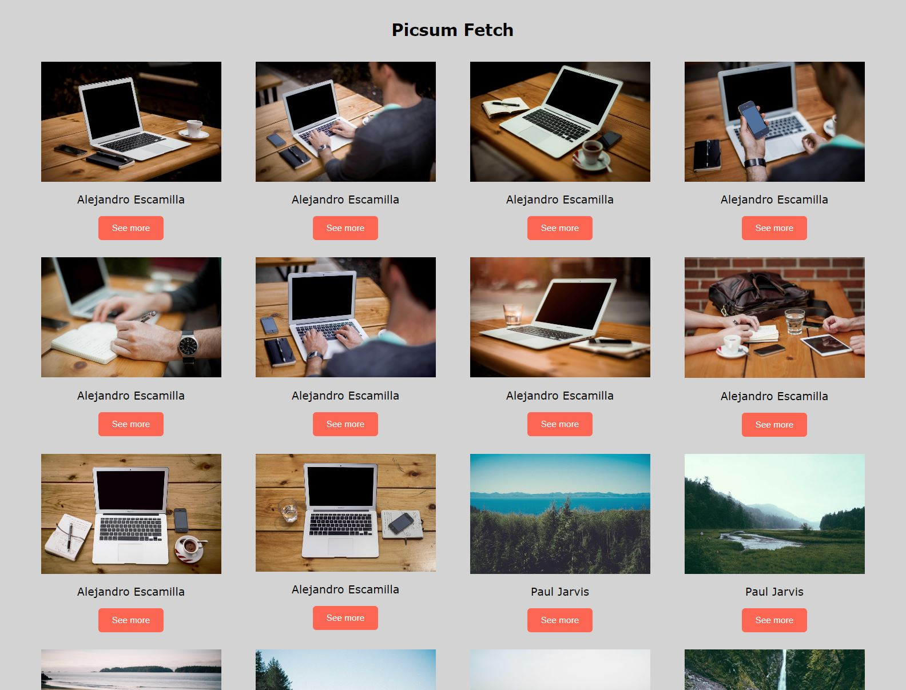

# Quiz – JavaScript-Projekt

## Beschreibung

Dieses JavaScript-Projekt wurde im Rahmen eines Coding-Bootcamps bei supercode.de erstellt. 
Es handelt sich um eine Bildergalerie, welche über eine Picsum-API per fetch("https://picsum.photos/v2/list") generiert wird.

## Tools/Technologien
- HTML5
- CSS3
- Vanilla JavaScript

## Programmablaufplan

1. **Start**
   - Setze `wrapper` auf das DOM-Element mit der Klasse "wrapper".

2. **Führe eine HTTP-Anfrage durch:**
   - Verwende die Fetch-API, um die Ressource "https://picsum.photos/v2/list" abzurufen.
   
   2.1. **Überprüfe, ob die Antwort erfolgreich ist:**
      - Falls nicht erfolgreich:
         - Werfe einen Fehler mit der Nachricht "Hier ist etwas schief gelaufen".
      - Falls erfolgreich:
         - Parste die Antwort als JSON.

   2.2. **Für jedes Element in den Daten:**
      - Erstelle ein neues `figure`-Element.
      - Erstelle ein neues `img`-Element und setze die Quelle und den Alternativtext.
      - Erstelle ein neues `figcaption`-Element und setze den Text.
      - Erstelle ein neues `button`-Element:
         - Füge einen Klick-Eventlistener hinzu, der ein neues Fenster mit der URL des Elements öffnet.
         - Setze den Text des Buttons auf "See more".
      - Füge das `img`, das `figcaption`, und den `button` zum `figure`-Element hinzu.
      - Füge das `figure`-Element zum `wrapper` hinzu.

3. **Fehlerbehandlung:**
   - Falls ein Fehler auftritt, gib den Fehler in der Konsole aus.

4. **Ende**

## Screenshot

### Ansicht der Webseite

## GitHub Live Vorschau

Du findest eine Live Vorschau auf GitHub: [GitHub Live Vorschau](https://w1tch3r-code.github.io/js_picsum_api_final/)

## GitHub Repository

Du findest das gesamte Projekt auf GitHub: [GitHub Repository](https://github.com/w1tch3r-code/js_picsum_api_final)

## Anmerkungen

- Dieses Projekt wurde im Rahmen eines Coding-Bootcamps bei supercode.de erstellt.
- Es handelt sich um eine Bildergalerie, welche über eine Picsum-API per fetch("https://picsum.photos/v2/list") generiert wurde.
- Die README.md-Datei dient auch als Bewerbungsunterlage und präsentiert meine Fähigkeiten in der Webentwicklung.
