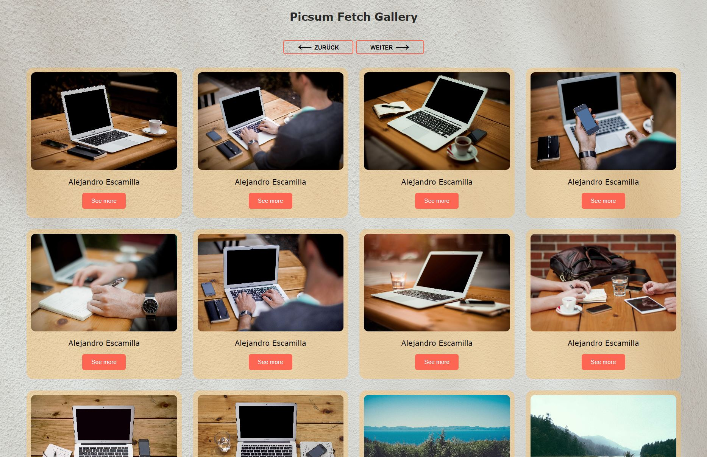

# Quiz – JavaScript-Projekt

## Beschreibung

Dieses JavaScript-Projekt wurde im Rahmen eines Coding-Bootcamps bei supercode.de erstellt. 
Es handelt sich um eine Bildergalerie, welche über eine Picsum-API per fetch("https://picsum.photos/v2/list") generiert wird.

## Tools/Technologien
- HTML5
- CSS3
- Vanilla JavaScript

## Programmablaufplan

## Navigation

### Variablen:
- `navigationBtn`: NodeList von Buttons mit der Klasse "nav-btn"
- `outputGallery`: Das DOM-Element mit der Klasse "gallery__wrapper"
- `pageNumber`: Aktuelle Seitenzahl, initial auf 1 gesetzt

### Funktionen:
1. `navigation()`
   - Iteriere über alle Buttons mit der Klasse "nav-btn"
     - Füge einen Klick-Eventlistener hinzu:
       - Wenn der Index gerade ist, verringere die `pageNumber` und stelle sicher, dass sie nicht kleiner als 1 wird.
       - Wenn der Index ungerade ist, erhöhe die `pageNumber`.
       - Rufe die Funktion `requestFetch` auf.

## Fetch Picsum API

### Funktionen:
1. `requestFetch()`
   - Leere den Inhalt des `outputGallery`.
   - Führe eine Fetch-Anfrage durch:
     - Verwende die aktuellen Seitenzahl (`pageNumber`) in der Anfrage.
     - Wenn die Anfrage erfolgreich ist, parste die JSON-Daten.
     - Für jedes Bildobjekt in den Daten rufe die Funktion `addNewContent` auf.
     - Rufe die Funktionen `navigation` und `galleryObserver` auf.
     - Behandle Fehler, indem du sie in der Konsole ausgibst.

2. `addNewContent(siglePictureObj)`
   - Erstelle HTML-Elemente für ein Bildobjekt:
     - `figure`, `img`, `figcaption`, `button`.
   - Setze Attribute und Texte entsprechend dem Bildobjekt.
   - Füge das `figure`-Element zum `outputGallery` hinzu.

## Intersection Observer

### Funktionen:
1. `galleryObserver()`
   - Selektiere alle `figure`-Elemente.
   - Erstelle einen Intersection Observer mit den Optionen:
     - `root: null`, `rootMargin: "200px"`, `threshold: 0`, `delay: 500`.
   - Für jedes `figure`-Element beobachte Änderungen:
     - Wenn das Element sichtbar wird, setze die Opazität und die Transformation.
     - Wenn das Element nicht sichtbar ist, setze die Opazität und die Transformation anders.

## Initialisierung
- Rufe `requestFetch()` auf.

## Screenshot

### Ansicht der Webseite

## GitHub Live Vorschau

Du findest eine Live Vorschau auf GitHub: [GitHub Live Vorschau](https://w1tch3r-code.github.io/js_picsum_api_final/)

## GitHub Repository

Du findest das gesamte Projekt auf GitHub: [GitHub Repository](https://github.com/w1tch3r-code/js_picsum_api_final)

## Anmerkungen

- Dieses Projekt wurde im Rahmen eines Coding-Bootcamps bei supercode.de erstellt.
- Es handelt sich um eine Bildergalerie, welche über eine Picsum-API per fetch("https://picsum.photos/v2/list") generiert wurde.
- Die README.md-Datei dient auch als Bewerbungsunterlage und präsentiert meine Fähigkeiten in der Webentwicklung.
